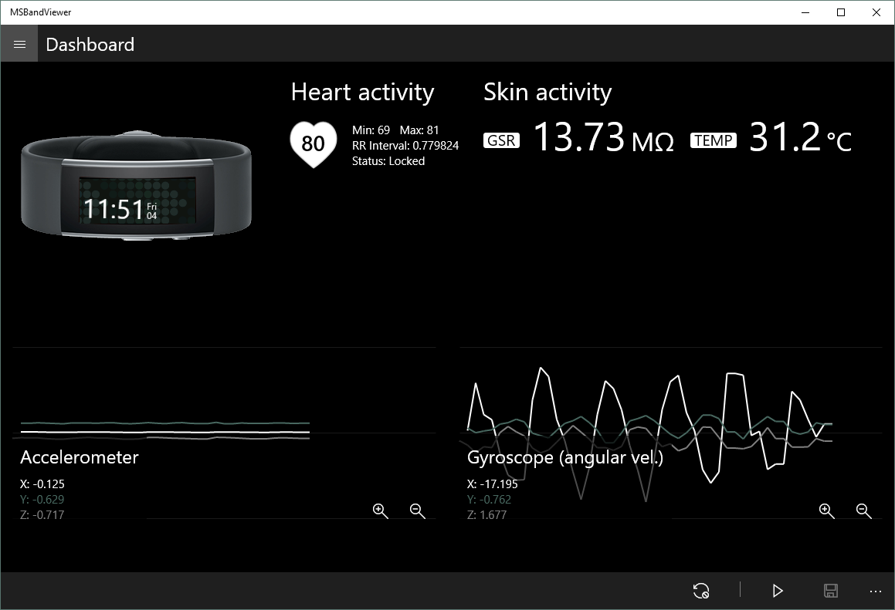
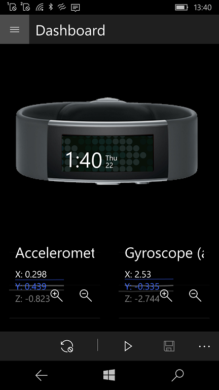

# MSBandViewer

**MSBandViewer** is a Universal Windows Platform application used for tracking the sensors of a Microsoft Band such as the Heart Rate sensor, RR Interval Sensor, Skin Temperature, etc. so you can then create and export a single file for analyzing the session data. 

## Screenshots

## Requirements

You need a Microsoft Band device for using this application (tested with Microsoft Band 2).

## Referencies

This application uses the custom **LineGraphCanvas** control for drawing time progressive Line Graphs. You can also [check the GIT repository](https://github.com/niuware/LineGraphCanvas) for this custom control.

## Author

This original MSBandViewer application was coded by Erik Lopez.

## ..

AS IS. No support! RnD only.

## .

W10M Remake by [m][e] :: 2022 
